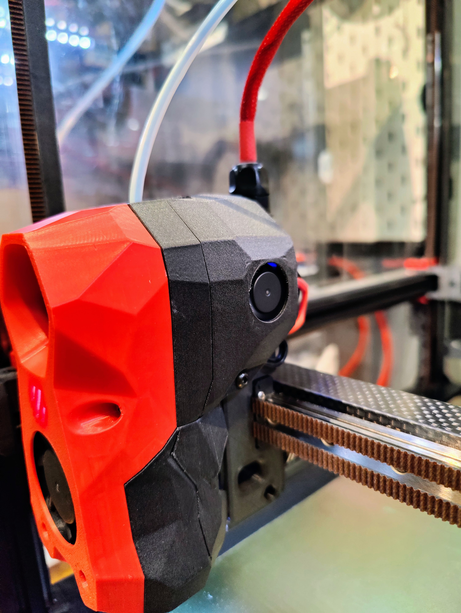
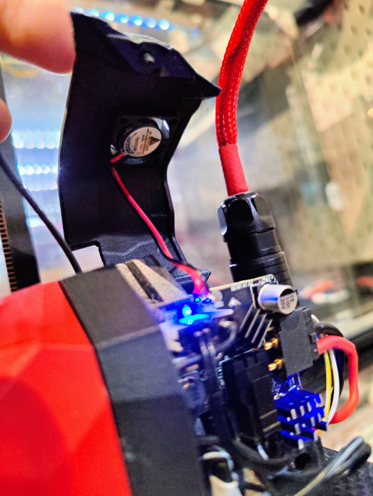

Fan cover for Fly-SB2040 CAN board, with 2006 5v fan

MCU temperature on FLY-SB2040 board 20-25°C above enclosure temperature, with LDO Motors ldo-36sth17-1004AHG (which runs extremely hot).
With fan and 20mm extruder stepper motor, temperature is about 10-15°C above enclosure temp.

Fan used in the setup:
https://www.aliexpress.com/item/1005003474968846.html

